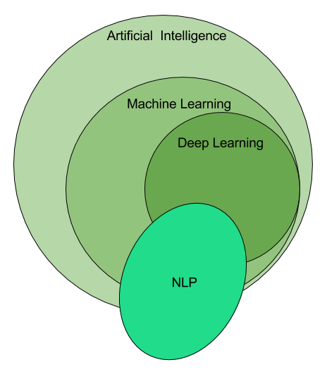
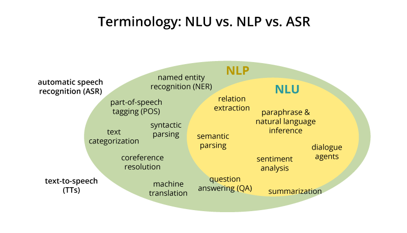
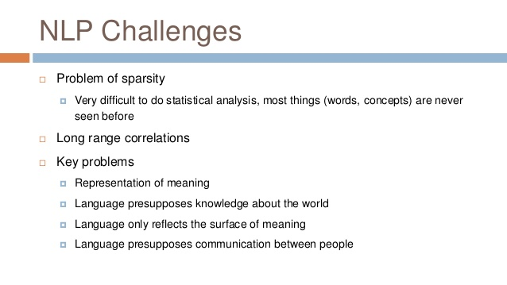

---
jupyter:
  jupytext:
    formats: ipynb,md
    text_representation:
      extension: .md
      format_name: markdown
      format_version: '1.3'
      jupytext_version: 1.10.2
  kernelspec:
    display_name: Python 3
    language: python
    name: python3
---

Módulo Advanced Data Science Natural Language Processing

# S0. Introducción al NLP

<!-- #region -->
*La inteligencia artificial es uno de los campos mas interesantes actualmente, y el lenguaje es la forma más convincente de inteligencia.*

En este curso estudiaremos el uso de técnicas de **Machine Learning y Deep Learning** para algunas de las aplicaciones de Procesamiento del Lenguaje Natural (NLP por sus siglas en inglés).

Pero esto no va a ser un curso general sobre NLP, hay muchísimas ramas dentro de la lingüistica computacional, y paradigmas que van más allá del Machine Learning, que no vamos a tocar.

El NLP se interesa en proporcionar modelos computacionales para **describir, modelar o reproducir distintos fenómenos lingüísticos**. Tiene como **principal objetivo** hacer que las máquinas puedan:

- comprender el lenguaje natural (NLU)
- generar lenguaje natural (NLG)

## Enfoques

Tradicionalmente, el NLP, como otras áreas de la Inteligencia Artificial, ha trabajado utilizando dos aproximaciones diferentes:

1. sistemas **basados en conocimiento**: en problemas que podemos modelar, proporcionamos conocimiento lingüístico formalizado y las **máquinas actúan aplicando reglas**.

2. sistemas **basados en estadística**: en problemas que son costosos o no podemos modelar, proporcionamos ingentes cantidades de datos (colecciones de documentos) y dejamos que la máquina cree el modelo a partir del cálculo de probabilidades y la detección de patrones de uso. Es decir, **utiliza los datos para generar las reglas**.

## Historia

El origen del NLP se puede asociar a la tarea de crear sistemas de **traducción automática**, y las primeras patentes son de mediados de los 1930s. Propuestas de diccionarios bilinguës como la de Georges Artsrouni o Peter Troyanskii datan de esas fechas.

En 1950, Alan Turing publica su famoso artículo "Computing Machinery and Intelligence" donde presenta el archifamoso **test de Turing** como criterio de inteligencia artificial.
Que consiste en que el ordenador tenga una conversación escrita con un humano, y el humano no sea capaz de discernir si está conversando con un humano o una máquina.

En la decada siguiente aparecen los llamados **sistemas expertos** que asistían en la toma de decisiones: sistemas de diálogo que trataban de imitar conversaciones humanas, creación de ontologías para capturar conocimiento del mundo.

Hasta los 1980s, la mayor parte de los sistemas de NLP intentaban capturar el significado del lenguaje usando reglas escritas por humanos. Estos sistemas basados en reglas, sin embargo, estaban muy limitados al dominio para el que se habían diseñado. En general, eran incapaces de lidiar con casos inesperados o que no habían sido vistos anteriormente, y fue demostrado que eran demasiado restrictivos como para capturar la complejidad del lenguaje natural [National Research Counciland Automatic Language Processing Advisory Committee, 1966](http://www.mt-archive.info/ALPAC-1966.pdf).

En los últimos 20 años, un enfoque estadístico del procesamiento del lenguaje natural se ha convertido en método común, que utiliza modelos matemáticos para aprender automáticamente las reglas de los datos, es decir, usamos **machine learning**. En consecuencia, en lugar de escribir reglas, el esfuerzo humano se canalizó en la creación de *features* que le dicen a un modelo qué propiedades y relaciones en los datos debe considerar para hacer su predicción. Sin embargo, este proceso de *feature engineering* requiere mucho tiempo humano, ya que las *features* generalmente son específicas de la tarea y requieren experiencia en el dominio. Esto requiere grandes colecciones de datos anotados manualmente y el aumento de potencia de los ordenadores.

En los últimos 8 años, el problema del diseño de *features*, que era el principal escollo de las técnicas anteriores, ha sido parcialmente solucionado mediante el resurgimiento de las **redes neuronales profundas**, el *deep learning*. Estos modelos aprenden de forma automática las *features* y por lo tanto reducen enormemente el tiempo humano necesario para hacer *feature engineering*. En este caso, el esfuerzo humano se ha trasladado a determinar las arquitecturas más adecuadas y mejores métodos de entrenamiento. El precio a pagar, la necesidad de más datos anotados y mayor capacidad de cómputo.

Este paradigma de **aprendizaje supervisado** en el NLP tiene grandes limitaciones, ya que es necesario anotar grandes cantidades de datos, y el método estándar de entrenamiento consiste en entrenar un modelo que empieza con pesos arbitrarios, es decir, cada nuevo modelo se entrena de cero. El conocimiento de tareas similares no es utilizado y los modelos siempre empiezan siendo una *tabula rasa*, de forma muy distinta a cómo los humanos generan conocimiento. De esta forma es muy difícil resolver los problemas actuales, el lenguaje humano es complejo y diverso, y no sólo es necesario tener modelos para la lengua inglesa, sino para los más de 6000 lenguajes del planeta. La única manera es desarrollar técnicas que permitan entrenar modelos que funcionen para nuevas tareas, dominios o lenguajes sin empezar de cero, y una solución es el **transfer learning**.

El **transfer learning** nos permite transferir conocimiento de dominios, tareas o lenguajes diferentes; y muchas técnicas recientes, como pueden ser el Latent Semantic Analysis (LSA) o los *word-embeddings* preentrenados, pueden considerarse formas de *transfer learning*. Esto ha supuesto una revolución en el campo del NLP, [similar a la producida en el campo de *Computer Vision* en el 2012](https://ruder.io/nlp-imagenet/). Y en este curso haremos uso de ellas.

Un resumen más detallado de la historia reciente de las aplicaciones de **deep learning** en NLP [puede encontrarse aquí](https://ruder.io/a-review-of-the-recent-history-of-nlp/index.html).

## Tareas típicas

El campo de NLP es muy amplio y, además, está en continuo desarrollo. Se están empezando a conseguir grandes avances en tareas que parecían imposibles de atacar, [pero aún queda mucho por hacer](https://ruder.io/4-biggest-open-problems-in-nlp/). Estamos viendo sus aplicaciones en nuestra vida cotidiana (Siri, Alexa, Google, etc); y seguro que veremos más en los próximos años.

Aquí hay una lista de algunas de las tareas que caen dentro de Procesamiento de Lenguaje Natural:

- Análisis morfo-sintáctico (*Part-of-speech (POS) tagging*): identifica si una palabra es un verbo, adjetivo, etc
- Reconocimiento de entidades (*named entity recognition (NER)*): identifica nombres de persona, orgaizaciones, localizaciones, códigos médicos, expresiones temporales, cantidades, valores monetarios, etc.
- Búsqueda de respuestas (*question answering*)
- Reconocimiento del habla (*speech recognition*) y síntesis de voz (*speech synthesis*)
- Texto a voz y voz a texto
- Segmentación de temas (*topic modeling*)
- Análisis de sentimientos / Clasificación (*sentiment analysis*)
- Recuperación de información (*information retrieval*)
- Modelos de lenguaje (*language models*)
- Traducción automática (*translation*)
- Resumen automático (*automatic summarization*)
- Desambiguación semántica (*word sense disambiguation*)
- Extracción de información (*information extraction*)
- Comprensión del lenguaje natural (*natural language understanding*): [Siri](https://www.apple.com/es/ios/siri/), [Google Assistant](https://assistant.google.com/intl/es_es/), [Cortana](https://www.microsoft.com/es-es/windows/cortana) y [Aura](https://aura.telefonica.com/espana).

## Peculiaridades de NLP

La primera pregunta es, ¿por qué estamos enseñando una asignatura de NLP y no lo hemos estudiado como una parte más del curso de Machine Learning? Esto se debe a que, aunque haremos uso extenso de las herramientas de Machine Learning, trabajar con texto tiene muchas peculiaridades que hacen que sean necesarias técnicas particulares para codificar esta información en números, que es con lo que solemos alimentar nuestros algoritmos. No sólo eso, sino que el lenguaje humano se ha desarrollado para que las personas se entiendas, y desde mucho antes de que existieran los ordenadores. Por ejemplo, para estudiar matemáticas se utiliza un lenguaje propio, ya que el lenguaje común no está bien adaptado a las matemáticas. Por razones similares, hay que trabajar sobre el texto crudo para que alimente de forma eficiente nuestros algoritmos.

El lenguaje natural es eminentemente **ambiguo**, altamente **dinámico** y su significado muy dependiente del **contexto**. Esta es la principal diferencia entre lenguas naturales y lenguajes artificiales.
  
Algunos ejemplos en castellano son:

* Neologismos: selfi, hacemos un skype, mandar un email, hacer retweet, 

* Lenguaje no estándar: xD, :), SEGURO???, seguimos con #machinelearning, 

* Expresiones/modismos: verle las orejas al lobo, darla con queso...

* Necesidad de contexto: rápido como un galgo, estoy leyendo el país. 

* Ambigüedades: río, banco, El Villarreal le ganó al Zaragoza en su campo, El perro de Carlos está muy viejo, Juana es una rata

Además, tenemos los problemas asociados a la representación del lenguaje en un formato entendible por las máquinas:
* Los métodos más inmediatos de representar palabras sufren del problema de gran dimensionalidad y *sparsity*.
* Para entender un texto a veces son necesarias las correlaciones de largo alcance.

## Blogs técnicos relacionados

- [Sebastian Ruder](http://ruder.io/): Excelente, muy buenos consejos y técnicamente impecable
- [Jay Alammar](https://jalammar.github.io/)
- [Abigail See](http://www.abigailsee.com/)
- [Joyce Xu](https://medium.com/@joycex99)
- [Evaluating Text Output in NLP: BLEU at your own risk - Rachael Tatman](https://towardsdatascience.com/evaluating-text-output-in-nlp-bleu-at-your-own-risk-e8609665a213)

## Librerías

- [nltk](https://www.nltk.org/): iniciada en 2001, librería amplia de NLP
- [spaCy](https://spacy.io/): buen tokenizador, tiene NER y POS tagger, permite entrenar modelos
- [gensim](https://radimrehurek.com/gensim/): creación de embeddings, topic modeling y similaridad entre palabras y documentos
- [transformers](https://github.com/huggingface/transformers): últimas novedades en modelos tipo transformers, está en constante avance, con lo que no es muy estable. pero es lo mejor para utilizar modelos *SOTA*

herramientas especializadas:
- [Flair](https://github.com/flairNLP/flair)
- [fastText](https://fasttext.cc/) has library of embeddings

librería de ML/Deep learning con herramientas de preprocesado de texto:
- [sklearn](https://scikit-learn.org/stable/): general purpose Python ML library
- tensorflow
- keras
- pytorch
- fastai

Página para testar diferentes herramientas de las librerías:
- http://textanalysisonline.com/
<!-- #endregion -->
